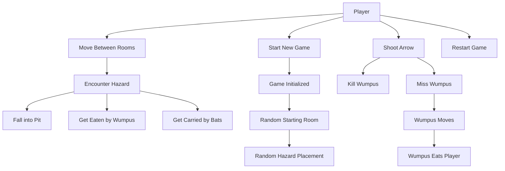
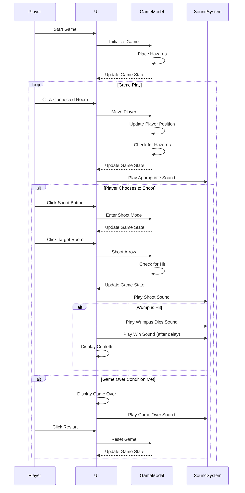
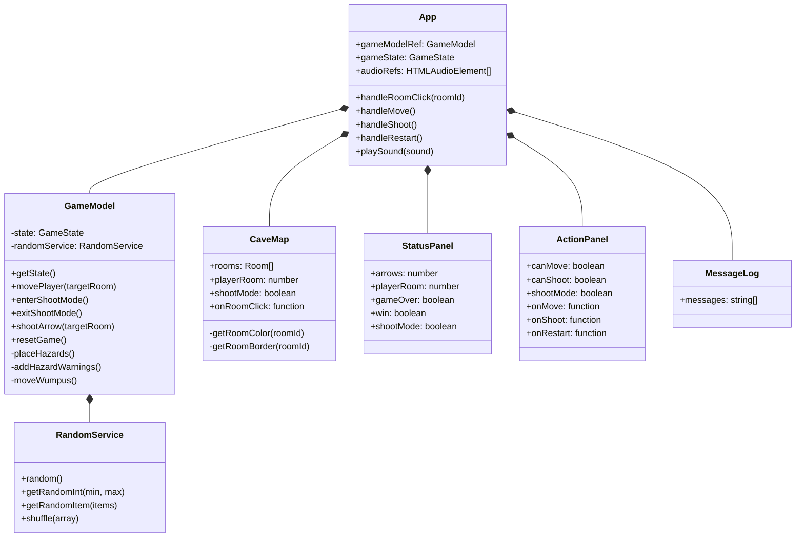
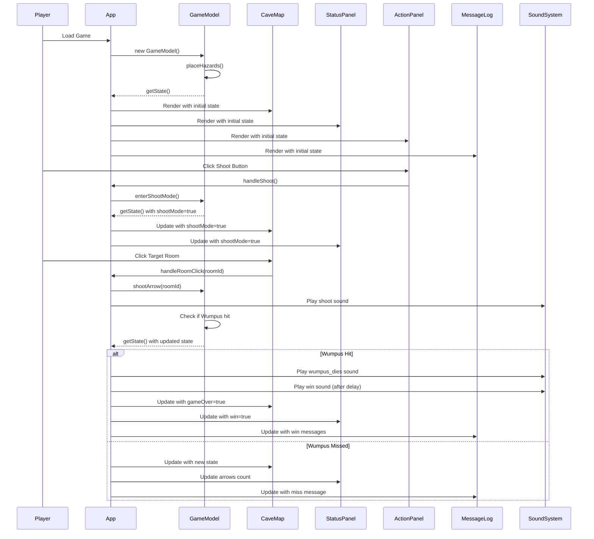
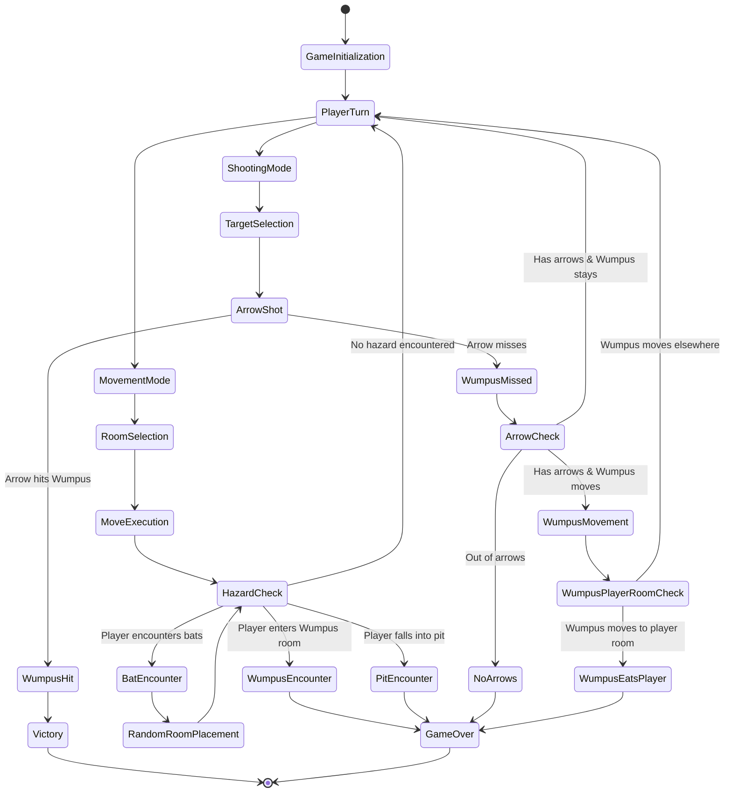
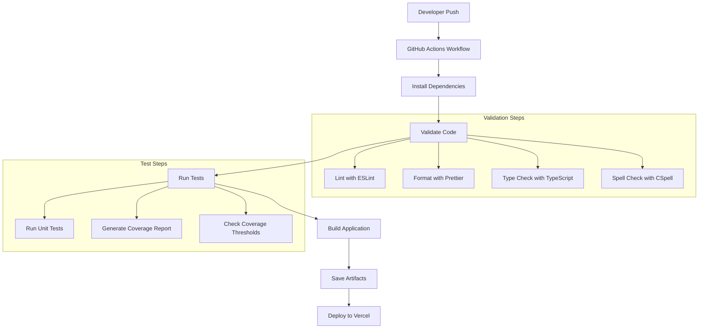

<!-- This documentation was generated by AI on May 4, 2025. -->

# Hunt the Wumpus Specification

## System Overview

### Core purpose and technical approach

Hunt the Wumpus is a graphical, single-page web implementation of the classic text-based adventure game originally created by Gregory Yob in 1973. This modern reimagining uses Next.js and TypeScript to create an interactive, visually appealing experience while maintaining the core gameplay mechanics of the original.

#### Key features and capabilities

- Interactive 16-room cave map with irregular connections
- Random hazard placement (Wumpus, pits, bats)
- Random starting room (always safe from hazards)
- Atmospheric room descriptions for immersion
- Intuitive movement and shooting mechanics
- Immersive sound effects for all game actions
- Medieval fantasy theme with decorative elements
- Victory celebration with confetti animation

#### Target audience

The game targets casual gamers familiar with classic computer games, as well as new players interested in logic-based adventure games. The intuitive interface makes it accessible to players of all ages and experience levels.

### Key technical capabilities with implementation highlights

- **Model-View-Controller Architecture**: Clean separation of game logic ([GameModel.ts](./src/model/GameModel.ts)) from presentation components ([view/](./src/view/))
- **Randomization Service**: Abstracted random operations for deterministic testing ([RandomService.ts](./src/services/RandomService.ts))
- **Responsive UI**: Adapts to different screen sizes while maintaining gameplay experience
- **Client-Side Rendering**: Uses Next.js with the "use client" directive to handle browser-specific APIs
- **Sound Management**: Preloads and manages multiple audio elements with error handling
- **State Management**: React hooks for managing game state and UI updates

### Target technical environment and constraints

- **Browser Support**: Modern web browsers (Chrome, Firefox, Safari, Edge)
- **Device Support**: Desktop and tablet devices with sufficient screen space for the game map
- **Network Requirements**: Minimal after initial load (client-side only application)
- **Performance Considerations**: Lightweight enough to run on modest hardware

## Requirements and Specification

### Use Cases



### Functional Requirements

1. The game must initialize with a 16-room cave map with irregular connections
2. The player must start in a random room with no hazards
3. The game must place 1 Wumpus, 2 pits, and 2 bat colonies randomly in the cave
4. The player must be able to move between connected rooms
5. The player must be able to shoot arrows into connected rooms
6. The player must start with 5 arrows
7. The game must provide warnings when hazards are in adjacent rooms
8. The game must track and display the player's current status
9. The game must maintain a message log of game events
10. The game must play appropriate sound effects for all game actions
11. The game must end when the player kills the Wumpus, falls into a pit, gets eaten by the Wumpus, or runs out of arrows

### Non-Functional Requirements

1. The game must have a medieval fantasy theme with atmospheric visuals
2. The game must provide unique descriptions for each room to enhance immersion
3. The game must have a responsive UI that adapts to different screen sizes
4. The game must provide clear visual feedback for player actions
5. The game must have a decorative title with medieval styling
6. The game must maintain a consistent frame rate during gameplay
7. The game must load quickly and be playable within seconds
8. The background image must maintain aspect ratio while filling the entire window
9. The game map should have a less transparent background (85% opacity) for better visibility

### Security Considerations

1. The game is client-side only, minimizing attack vectors
2. No sensitive data is stored or transmitted
3. All assets (images, sounds) are served from the same origin
4. No external API calls are made during gameplay

### Key functionality to implement to meet requirements

1. **Game Initialization**: Random room and hazard placement ([GameModel.ts:213-254](./src/model/GameModel.ts:213-254))
2. **Movement System**: Validating and executing player movement ([GameModel.ts:288-366](./src/model/GameModel.ts:288-366))
3. **Shooting System**: Arrow trajectory and hit detection ([GameModel.ts:400-459](./src/model/GameModel.ts:400-459))
4. **Hazard Detection**: Checking for and handling hazard encounters ([GameModel.ts:315-354](./src/model/GameModel.ts:315-354))
5. **Warning System**: Providing proximity warnings for nearby hazards ([GameModel.ts:257-275](./src/model/GameModel.ts:257-275))
6. **Sound Management**: Playing appropriate sounds for game events ([App.tsx:64-79](./src/App.tsx:64-79))
7. **Visual Feedback**: Highlighting available moves and shoot targets ([CaveMap.tsx:17-29](./src/view/CaveMap.tsx:17-29))

### User interaction flow



## Architecture

### High-level component architecture / class diagram



### Detailed interaction sequence



### Location/state handling flow



## Technical Stack

### Main Client and Server Applications

- **Frontend Framework**: Next.js 15.3.1
- **Language**: TypeScript 5.0.4
- **State Management**: React Hooks
- **UI Components**: Custom React components
- **Animation**: react-confetti 6.1.0

### Development Environment

- **Package Manager**: npm 10.2.4
- **Build Tool**: Next.js built-in build system
- **Code Editor**: Visual Studio Code (recommended)
- **Version Control**: Git

### Testing Environment

- **Testing Framework**: Jest 29.5.0
- **Test Runner**: ts-jest 29.1.0
- **Coverage Tool**: Jest built-in coverage reporting

### CI/CD Environment

- **CI/CD Platform**: GitHub Actions
- **Workflow Automation**: Custom GitHub Actions workflows
- **Code Quality**: ESLint, Prettier, TypeScript type checking
- **Spell Checking**: CSpell

### Deployment & Production Environment

- **Hosting**: Vercel (recommended for Next.js applications)
- **Static Assets**: Served via Next.js public directory
- **Build Output**: Static HTML, CSS, and JavaScript

## Development Environment

### Source Validation and Syntax Checking

- **Linting**: ESLint with TypeScript rules
- **Formatting**: Prettier
- **Type Checking**: TypeScript compiler
- **Pre-commit Hooks**: Husky for enforcing code quality standards
- **Spell Checking**: CSpell with custom dictionary

## Implementation

### Design Patterns with Justification

1. **Model-View-Controller (MVC)**

   - **Implementation**: Separation of [GameModel.ts](./src/model/GameModel.ts) (model), [view components](./src/view/) (view), and [App.tsx](./src/App.tsx) (controller)
   - **Justification**: Provides clear separation of concerns, making the codebase more maintainable and testable

2. **Dependency Injection**

   - **Implementation**: RandomService is injected into GameModel ([GameModel.ts:181](./src/model/GameModel.ts:181))
   - **Justification**: Enables unit testing with deterministic random behavior

3. **Immutable State**

   - **Implementation**: Game state is never directly modified ([GameModel.ts:284](./src/model/GameModel.ts:284))
   - **Justification**: Prevents unintended side effects and makes state changes predictable

4. **Factory Method**
   - **Implementation**: Creation of hazards in placeHazards method ([GameModel.ts:213-254](./src/model/GameModel.ts:213-254))
   - **Justification**: Encapsulates the complex initialization logic

### Key Algorithms and complexity analysis

1. **Hazard Placement Algorithm**

   - **Implementation**: [GameModel.ts:213-254](./src/model/GameModel.ts:213-254)
   - **Complexity**: O(n) where n is the number of rooms
   - **Description**: Randomly places hazards in available rooms, ensuring the player's starting room is safe

2. **Hazard Warning Detection**

   - **Implementation**: [GameModel.ts:257-275](./src/model/GameModel.ts:257-275)
   - **Complexity**: O(c) where c is the number of connections per room (constant)
   - **Description**: Checks adjacent rooms for hazards and provides appropriate warnings

3. **Wumpus Movement Algorithm**
   - **Implementation**: [GameModel.ts:462-471](./src/model/GameModel.ts:462-471)
   - **Complexity**: O(1)
   - **Description**: Randomly moves the Wumpus to an adjacent room when triggered

### Interface Definitions & Data Structures

1. **Room Interface**

   - **Definition**: [GameModel.ts:10-16](./src/model/GameModel.ts:10-16)
   - **Purpose**: Defines the structure of a room in the cave

2. **Player Interface**

   - **Definition**: [GameModel.ts:18-22](./src/model/GameModel.ts:18-22)
   - **Purpose**: Tracks player state including current room, arrows, and alive status

3. **GameState Interface**

   - **Definition**: [GameModel.ts:24-34](./src/model/GameModel.ts:24-34)
   - **Purpose**: Comprehensive game state including rooms, player, hazards, and game status

4. **Hazard Enum**

   - **Definition**: [GameModel.ts:3-8](./src/model/GameModel.ts:3-8)
   - **Purpose**: Defines the types of hazards in the game

5. **RandomService Interface**
   - **Definition**: [RandomService.ts:8-31](./src/services/RandomService.ts:8-31)
   - **Purpose**: Abstracts random operations for testability

## Test

### Test Strategy

- **Unit Testing**: Individual components and functions are tested in isolation
- **Integration Testing**: Interactions between components are tested
- **Coverage Targets**: 35% statements, 70% branches, 40% functions, 35% lines

#### Difficult to test features

- **Random Behavior**: Addressed by injecting a mock RandomService with deterministic output
- **Sound Playback**: Mocked in tests to avoid actual audio playback
- **UI Interactions**: Tested using React Testing Library's simulated events

### Mocking Strategy

- **Random Service**: Mocked for deterministic testing ([**mocks**/RandomService.ts](./src/__mocks__/RandomService.ts))
- **Audio Elements**: Mocked to prevent actual sound playback during tests
- **Browser APIs**: Mocked for testing window-dependent functionality

## CI/CD

### CI/CD Pipeline



## Deployment

### Deployment Strategy

- **Platform**: Vercel (optimized for Next.js)
- **Build Process**: Next.js production build
- **Asset Handling**: Static assets served from the public directory
- **Environment Variables**: None required for basic deployment

## Technical Evaluation

### Architecture evaluation matrix (strengths/weaknesses)

| Aspect                    | Strengths                                              | Weaknesses                                      |
| ------------------------- | ------------------------------------------------------ | ----------------------------------------------- |
| **MVC Architecture**      | Clear separation of concerns, maintainable code        | Potential overhead for a simple game            |
| **Next.js Framework**     | Modern, optimized for React, good developer experience | May be overkill for a simple game               |
| **TypeScript**            | Type safety, better IDE support, fewer runtime errors  | Learning curve, additional build step           |
| **Client-Side Rendering** | Simpler deployment, no server requirements             | Initial load time may be longer                 |
| **Sound Implementation**  | Comprehensive sound effects for immersion              | Browser autoplay policies may affect experience |
| **Randomization**         | Creates replayability                                  | May create unwinnable scenarios in rare cases   |

### Performance characteristics and bottlenecks

- **Initial Load**: The main bottleneck is loading sound files and images
- **Runtime Performance**: Minimal CPU usage during gameplay
- **Memory Usage**: Low, primarily for game state and audio elements
- **Render Performance**: Efficient with minimal re-renders

### Scalability considerations

- **Additional Rooms**: The current implementation can easily scale to more rooms
- **Additional Hazards**: New hazard types can be added to the Hazard enum
- **Difficulty Levels**: Could be implemented by adjusting hazard counts and arrow limits

### Technical debt assessment

- **Sound Management**: Could be refactored into a dedicated service
- **Game State Management**: Could benefit from a more robust state management solution for larger games
- **Test Coverage**: Additional tests needed for view components
- **Accessibility**: Keyboard navigation and screen reader support could be improved

## Technical Reference

### Development Guide

#### API documentation with usage examples

**GameModel API**

```typescript
// Initialize a new game
const gameModel = new GameModel();

// Get the current game state
const state = gameModel.getState();

// Move the player to a connected room
if (gameModel.isValidMove(targetRoom)) {
  const messages = gameModel.movePlayer(targetRoom);
  console.log(messages); // Array of messages about the move
}

// Enter shooting mode
const shootMessages = gameModel.enterShootMode();

// Shoot an arrow
if (gameModel.isValidShootTarget(targetRoom)) {
  const shotMessages = gameModel.shootArrow(targetRoom);
  console.log(shotMessages); // Array of messages about the shot
}

// Reset the game
gameModel.resetGame();
```

**RandomService API**

```typescript
// Create a default random service
const randomService = new DefaultRandomService();

// Get a random number between 0 and 1
const randomValue = randomService.random();

// Get a random integer between min (inclusive) and max (exclusive)
const randomInt = randomService.getRandomInt(0, 10);

// Get a random item from an array
const randomItem = randomService.getRandomItem(['apple', 'banana', 'cherry']);

// Shuffle an array
const shuffledArray = randomService.shuffle([1, 2, 3, 4, 5]);
```

#### Configuration reference

No specific configuration is required for the basic game. The cave layout is defined in [GameModel.ts:37-173](./src/model/GameModel.ts:37-173) and can be modified to create different cave layouts.

### Setup instructions & Local development workflow

1. **Clone the repository**

   ```bash
   git clone https://github.com/rpurser47/wumpus.git
   cd wumpus
   ```

2. **Install dependencies**

   ```bash
   npm install
   ```

3. **Start the development server**

   ```bash
   npm run dev
   ```

4. **Open the game in your browser**
   Navigate to `http://localhost:3000`

5. **Build for production**

   ```bash
   npm run build
   ```

6. **Run production build locally**
   ```bash
   npm start
   ```

### Testing procedures

1. **Run all tests**

   ```bash
   npm test
   ```

2. **Run tests without coverage**

   ```bash
   npm run test:nocoverage
   ```

3. **Run tests in watch mode**

   ```bash
   npm test -- --watch
   ```

4. **View test coverage report**
   After running tests with coverage, open `coverage/lcov-report/index.html` in a browser

### Troubleshooting guide for common technical issues

1. **"Window is not defined" error**

   - Ensure the "use client" directive is at the top of components using browser APIs
   - Use dynamic imports with `ssr: false` for components using browser-specific features

2. **Sound not playing**

   - Check browser autoplay policies
   - Ensure sound files exist in the correct location (`public/sounds/`)
   - Add user interaction before attempting to play sounds

3. **Game not rendering correctly**

   - Verify that the cave background image exists at `public/cave-bg.jpg`
   - Check browser console for any JavaScript errors
   - Ensure the browser window is large enough to display the game properly

4. **Tests failing with random behavior**

   - Ensure tests are using the mock RandomService for deterministic results
   - Check for time-dependent tests that might be flaky

5. **Build failures**
   - Run `npm run lint` and `npm run type-check` to identify issues
   - Check for TypeScript errors that might be preventing successful builds

<!-- This documentation was generated by AI on May 4, 2025. -->
