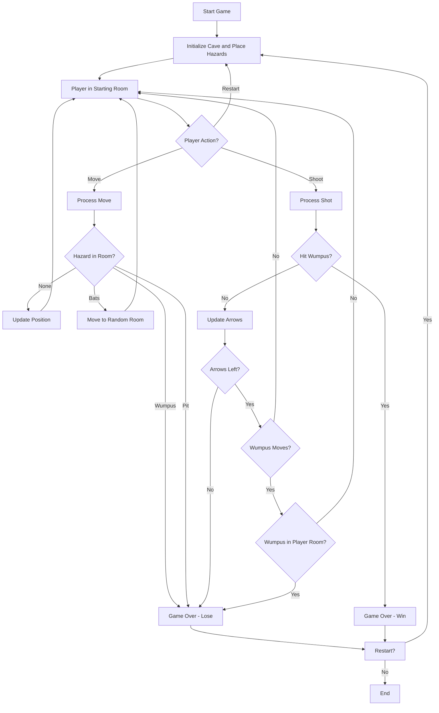
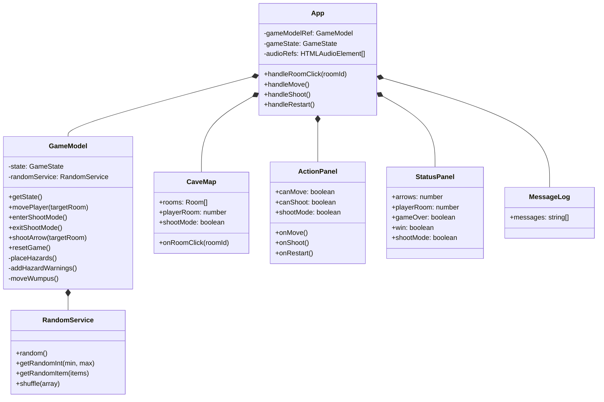
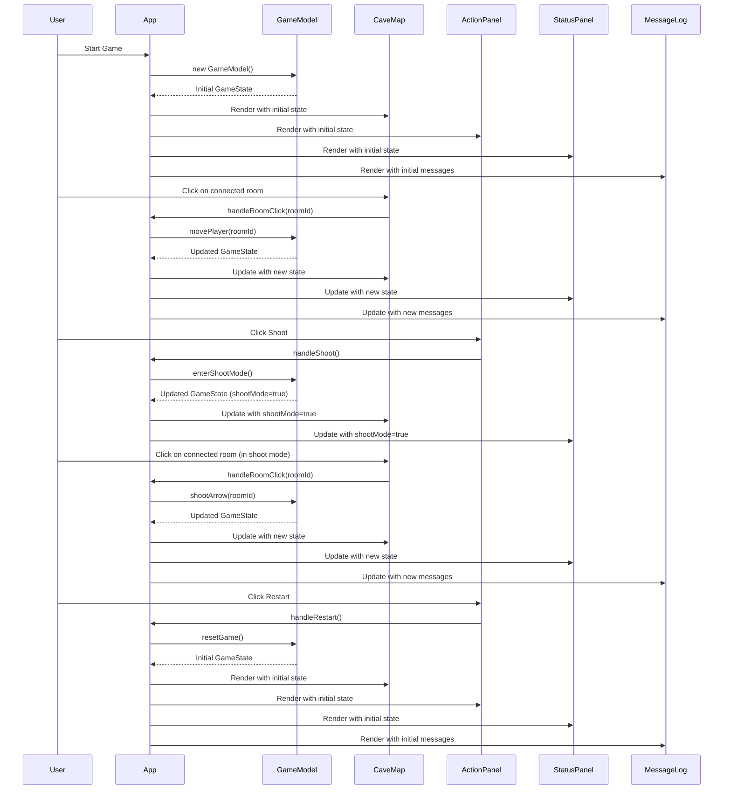
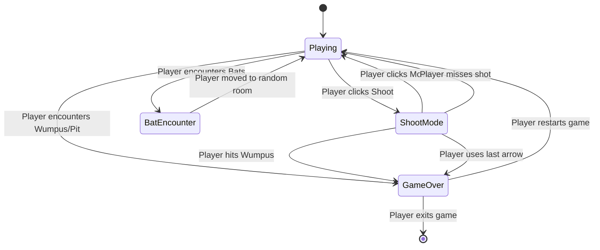

<!-- This documentation was generated by AI. -->

# Hunt the Wumpus - Game Specification

## Project Overview

### Brief description

Hunt the Wumpus is a medieval fantasy-themed implementation of the classic text-based game originally created by Gregory Yob in 1973. In this modern version, players navigate through a network of interconnected cave rooms, attempting to hunt and kill the Wumpus monster while avoiding hazards such as bottomless pits and giant bats.

### Key features and capabilities

- Interactive graphical user interface with a 2D cave map visualization
- Turn-based gameplay with movement and arrow shooting mechanics
- Hazards including the Wumpus monster, bottomless pits, and giant bats
- Atmospheric room descriptions and sound effects for all game actions
- Visual and audio feedback for game events
- Win/lose conditions with appropriate celebrations or notifications
- Responsive design that works across different screen sizes

### Target audience and use cases

- Casual gamers looking for a simple but engaging strategy game
- Fans of classic computer games interested in a modern adaptation
- Educational settings where the game can be used to teach basic logic and probability
- Players of all ages who enjoy fantasy-themed adventure games

## Requirements

### Use Cases

1. **Starting a New Game**

   - The player starts the game and is placed in a random room with no hazards
   - The game generates a new cave layout with randomly placed hazards
   - The player receives initial information about their surroundings

2. **Moving Between Rooms**

   - The player selects an adjacent room to move to
   - The game validates the move and updates the player's position
   - The player receives feedback about the new room and any nearby hazards

3. **Shooting Arrows**

   - The player enters shoot mode and selects a connected room to fire an arrow into
   - The game determines if the arrow hits the Wumpus
   - The player receives feedback about the result of their shot

4. **Encountering Hazards**

   - The player moves into a room with a hazard (Wumpus, pit, or bats)
   - The game processes the consequences of the encounter
   - The player receives appropriate feedback (game over or being moved to a new room)

5. **Winning the Game**

   - The player successfully shoots the Wumpus
   - The game displays a victory celebration with confetti and sound effects
   - The player can choose to restart the game

6. **Losing the Game**
   - The player encounters the Wumpus or falls into a pit
   - The game displays a game over message and plays appropriate sound effects
   - The player can choose to restart the game

### Functional Requirements

1. **Game Initialization**

   - Generate a cave with 16 interconnected rooms
   - Place the Wumpus, 2 pits, and 2 bat colonies randomly in the cave
   - Place the player in a random room that contains no hazards
   - Initialize the player with 5 arrows

2. **Player Movement**

   - Allow the player to move only to connected rooms
   - Update the player's position when a valid move is made
   - Provide visual and audio feedback for movement

3. **Hazard Detection**

   - Detect when the player is adjacent to a hazard
   - Provide appropriate warnings (smell for Wumpus, draft for pits, rustling for bats)
   - Display warnings in the message log

4. **Arrow Shooting**

   - Allow the player to enter shoot mode when they have arrows remaining
   - Validate target rooms for shooting (must be connected to current room)
   - Process the result of the shot (hit Wumpus, miss, or run out of arrows)

5. **Hazard Encounters**

   - Process Wumpus encounters (player dies, game over)
   - Process pit encounters (player dies, game over)
   - Process bat encounters (player is moved to a random room)

6. **Game State Management**

   - Track the player's current room, number of arrows, and alive status
   - Track the game's win/lose state
   - Maintain a message log of game events

7. **Game Reset**
   - Allow the player to restart the game at any time
   - Reset all game state to initial values
   - Generate a new random cave layout

### Non-Functional Requirements

1. **Performance**

   - The game should load and initialize within 3 seconds
   - All user interactions should have immediate feedback
   - Sound effects should play without noticeable delay

2. **Usability**

   - The UI should be intuitive and easy to understand
   - The cave map should clearly indicate the player's position and possible moves
   - Game messages should be clear and informative

3. **Compatibility**

   - The game should work in modern web browsers
   - The game should be responsive and adapt to different screen sizes
   - The game should work with or without sound enabled

4. **Maintainability**
   - The code should follow a clear architectural pattern (MVC)
   - Components should be modular and reusable
   - The codebase should have comprehensive test coverage

### Security Considerations

1. **Client-Side Only**

   - As a client-side only game, there are minimal security concerns
   - No sensitive data is stored or transmitted
   - No server-side components that could be exploited

2. **Asset Security**
   - Game assets (images, sounds) are publicly accessible
   - No DRM or protection mechanisms are required
   - Assets should be properly licensed for use in the game

## Functional Specification

### User interaction flow



## Architecture

### High-level component architecture



### Detailed interaction sequence



### Location/state handling flow



## Implementation

The Hunt the Wumpus game is implemented using a Model-View-Controller (MVC) architecture pattern:

### Model

- [GameModel.ts](../src/model/GameModel.ts): Contains the core game logic, state management, and game rules
- Defines the game state, room structure, hazards, and player information
- Handles game initialization, hazard placement, and game state updates
- Processes player actions (movement, shooting) and their consequences

### View

- [CaveMap.tsx](../src/view/CaveMap.tsx): Renders the interactive cave map with rooms and connections
- [ActionPanel.tsx](../src/view/ActionPanel.tsx): Provides buttons for player actions (move, shoot, restart)
- [StatusPanel.tsx](../src/view/StatusPanel.tsx): Displays game status information (arrows, current room, game state)
- [MessageLog.tsx](../src/view/MessageLog.tsx): Shows game messages and feedback to the player

### Controller

- [App.tsx](../src/App.tsx): Connects the model and view components
- Manages user interactions and updates the UI based on game state changes
- Handles audio playback for game events
- Controls game flow and state transitions

### Services

- [RandomService.ts](../src/services/RandomService.ts): Provides randomization functionality for the game
- Abstracts random operations to enable deterministic testing

## Test

The project uses Jest for testing with the following approach:

1. **Unit Tests**

   - Tests for individual components and functions
   - Mocked dependencies for isolated testing
   - Coverage thresholds set in jest.config.js:
     - Statements: 80%
     - Branches: 80%
     - Functions: 80%
     - Lines: 80%

2. **Test Structure**

   - Tests are located in the `src/__tests__` directory
   - Each component and service has corresponding test files
   - Test files follow the naming convention `*.test.tsx` or `*.test.ts`

3. **Mocks**
   - Audio elements are mocked for testing
   - RandomService is mocked for deterministic testing of game logic

## CI/CD

The project uses GitHub Actions for continuous integration and deployment:

1. **Validation**

   - Linting with ESLint
   - Format checking with Prettier
   - Type checking with TypeScript
   - Spell checking with cspell
   - Dependency vulnerability scanning

2. **Testing**

   - Runs all tests with coverage reporting
   - Uploads coverage reports as artifacts

3. **Build and Deploy**
   - Builds the Next.js application
   - Creates and uploads build artifacts
   - (Optional) Deployment to Vercel (currently commented out)

The workflow is defined in [.github/workflows/ci-cd.yml](../.github/workflows/ci-cd.yml).

## Deployment

The application is built with Next.js and can be deployed in several ways:

1. **Local Development**

   - Run `npm run dev` for development mode
   - Access the application at http://localhost:3000

2. **Static Build**

   - Run `npm run build` to create a production build
   - Run `npm start` to serve the production build

3. **Vercel Deployment**
   - The CI/CD pipeline includes configuration for Vercel deployment
   - Requires setting up Vercel secrets in GitHub repository

## Technical Stack

- **Framework**: Next.js 15.3.1
- **Language**: TypeScript
- **UI**: React with CSS-in-JS styling
- **Testing**: Jest with ts-jest
- **Code Quality**: ESLint, Prettier, TypeScript
- **CI/CD**: GitHub Actions
- **Deployment**: Vercel (configured but not active)

## Core Components

1. **Game Model**

   - Manages game state and logic
   - Handles hazard placement and detection
   - Processes player actions and their consequences

2. **Cave Map**

   - Visual representation of the cave network
   - Interactive SVG-based map with clickable rooms
   - Visual indicators for player position and valid moves

3. **Action Panel**

   - Control panel for player actions
   - Buttons for movement, shooting, and game restart
   - Visual feedback for current game mode

4. **Status Panel**

   - Displays game status information
   - Shows arrow count and current room
   - Indicates game state (playing, game over, win)

5. **Message Log**
   - Chronological list of game events and messages
   - Provides feedback about game actions and hazards
   - Displays atmospheric room descriptions

## API Documentation & Example Usage

### GameModel API

```typescript
// Create a new game instance
const gameModel = new GameModel();

// Get the current game state
const state = gameModel.getState();

// Move the player to a connected room
const messages = gameModel.movePlayer(targetRoomId);

// Enter shoot mode
gameModel.enterShootMode();

// Exit shoot mode
gameModel.exitShootMode();

// Shoot an arrow at a target room
const shotResult = gameModel.shootArrow(targetRoomId);

// Reset the game
gameModel.resetGame();
```

### RandomService API

```typescript
// Create a default random service
const randomService = new DefaultRandomService();

// Get a random number between 0 and 1
const value = randomService.random();

// Get a random integer between min (inclusive) and max (exclusive)
const randomInt = randomService.getRandomInt(0, 10);

// Get a random item from an array
const randomItem = randomService.getRandomItem(['a', 'b', 'c']);

// Shuffle an array
const shuffledArray = randomService.shuffle([1, 2, 3, 4, 5]);
```

## Data Flow

1. **Game Initialization**

   - App component creates a GameModel instance
   - GameModel initializes the cave layout and places hazards
   - Initial game state is passed to view components for rendering

2. **Player Actions**

   - User interacts with the UI (clicks on rooms or buttons)
   - App component handles these interactions and calls appropriate GameModel methods
   - GameModel updates the game state based on the action
   - Updated state is passed back to view components for re-rendering

3. **Game Events**
   - GameModel generates messages based on game events
   - App component plays appropriate sound effects
   - View components update to reflect the new game state
   - MessageLog displays feedback about the event

## Development Guide

### Setup instructions

1. Clone the repository:

   ```bash
   git clone https://github.com/rpurser47/wumpus.git
   cd wumpus
   ```

2. Install dependencies:

   ```bash
   npm install
   ```

3. Start the development server:

   ```bash
   npm run dev
   ```

4. Open [http://localhost:3000](http://localhost:3000) in your browser

### Environment variables

This project does not require any environment variables for local development.

### Local development workflow

1. Make code changes in the `src` directory
2. The development server will automatically reload with your changes
3. Run tests to ensure your changes don't break existing functionality:

   ```bash
   npm test
   ```

4. Format and lint your code before committing:
   ```bash
   npm run format
   npm run lint
   ```

### Testing procedures

1. Run all tests:

   ```bash
   npm test
   ```

2. Run tests with coverage:

   ```bash
   npm test
   ```

   (Coverage is enabled by default)

3. Run tests without coverage:
   ```bash
   npm run test:nocoverage
   ```

### Areas for Improvement

1. **Test Coverage**

   - Increase test coverage for view components
   - Add integration tests for component interactions
   - Add end-to-end tests for complete game scenarios

2. **Accessibility**

   - Improve keyboard navigation
   - Add screen reader support
   - Enhance color contrast for better visibility

3. **Game Features**

   - Add difficulty levels
   - Implement custom cave layouts
   - Add a high score system

4. **Performance**
   - Optimize rendering of the cave map
   - Improve asset loading and caching
   - Reduce bundle size for faster loading

### Potential Bugs

1. **Audio Playback**

   - Sound effects may not play in browsers that block autoplay
   - Multiple sounds playing simultaneously might cause audio issues

2. **Random Generation**

   - In rare cases, the random placement of hazards might create unwinnable scenarios
   - Bat encounters could potentially move the player into a hazardous room

3. **UI Interactions**
   - Rapid clicking on rooms might cause unexpected behavior
   - Touch events on mobile devices might not register correctly in some cases

<!-- This documentation was generated by AI. -->
